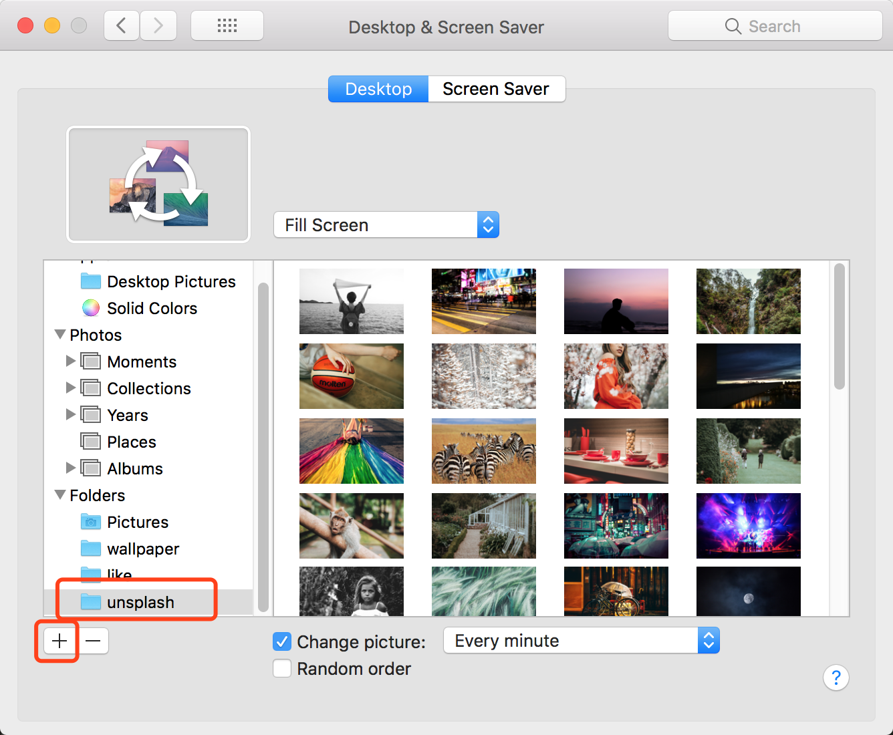

# unsplash_wallpaper_autodownload
auto download desktop wallpaper from https://source.unsplash.com
# How to install
1. `git clone git@github.com:MioYvo/unsplash_wallpaper_autodownload.git`
2. `cd unsplash_wallpaper_autodownload`
3. modify *config.json*
3. `python install.py`

### after change config
if you modified *config.json*, you need to reinstall
`python install.py`


### How to set this pics as my Desktop
1. check *config.json* to find your unsplash folder

    ```
    {
        ...
        "wallpapers_folder": "~/Pictures/unsplash",
        ...
    }
    ```
4. open **System Preferences** --> **Desktop & Screen Saver** --> **Desktop**

